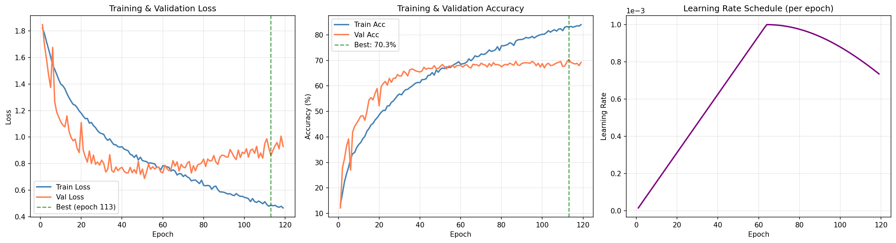
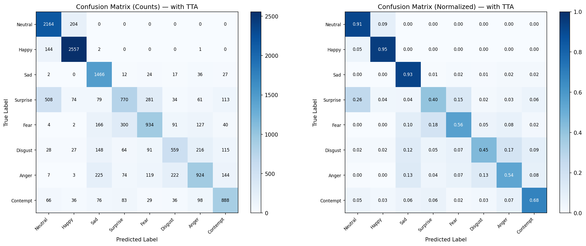
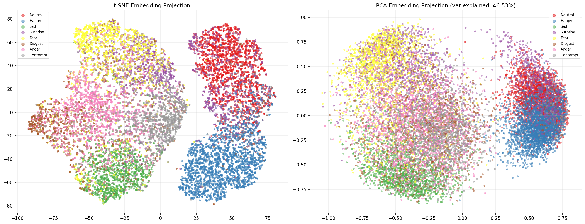
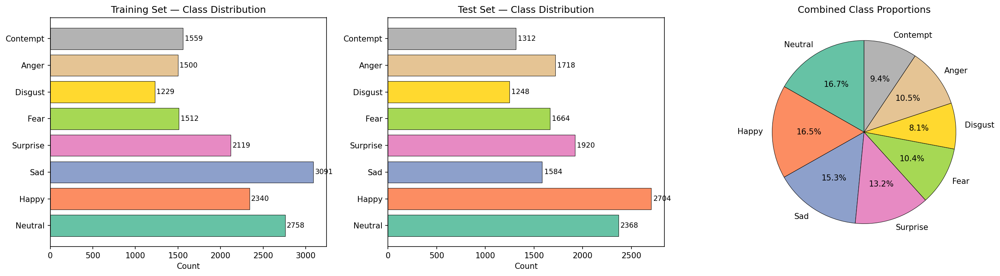

<div align="center">

# 🧠 HSSN — Hierarchical Spectral-Spatial Network

### A Novel Deep Learning Architecture for Real-Time Facial Expression Recognition

**Designed from first principles · Trained from scratch · No pretrained weights**

[](https://python.org)
[](https://pytorch.org)
[](http://mohammadmahoor.com/affectnet/)

<br>

**70.68% Accuracy** on AffectNet (8 classes) · **~9M Parameters** · **Trained on a GTX 1650 (4GB VRAM)**

</div>

---

## 📌 What Is This?

HSSN is an **original neural network architecture** I designed to recognize 8 facial expressions from images and video in real-time. Unlike most approaches that fine-tune pretrained models (ResNet, VGG, EfficientNet), HSSN is built and trained **entirely from scratch** — no transfer learning, no ImageNet weights.

The core idea: facial expressions encode information in **both spatial and frequency domains**. HSSN processes both simultaneously through dual pathways fused via learned channel attention — capturing edge-based features (spatial) and subtle textural patterns (spectral) that single-domain architectures miss.

### What I Built

- 🏗️ **A completely original deep learning architecture** with novel dual-path processing
- 📊 **A 20-stage research pipeline** — from data analysis to training to explainability
- 🎥 **A real-time video analysis tool** — multi-face detection, per-face emotion tracking, live dashboard
- 📹 **A live webcam tool** — instant emotion detection from your camera
- 🧪 **Complete evaluation** — confusion matrices, t-SNE embeddings, gradient-based explainability maps

---

## 🏗️ Architecture — What Makes HSSN Different

```
Input (224×224 RGB)
    │
    ▼
┌─────────────────────────────┐
│ Stem: 7×7 Conv, stride=2    │
└────────────┬────────────────┘
             │
    ╔════════╧══════════════════════════════════════╗
    ║   4 Stages × 3 DualPathBlocks each            ║
    ║                                                ║
    ║   ┌─────────────┐    ┌──────────────┐          ║
    ║   │ Spatial Path │    │ Spectral Path│          ║
    ║   │ (DW+PW Conv) │    │ (FFT Filter) │          ║
    ║   └──────┬──────┘    └──────┬───────┘          ║
    ║          └──────┬───────────┘                   ║
    ║          ┌──────▼──────┐                        ║
    ║          │ Channel Gate │  ← Learned α fusion   ║
    ║          └──────┬──────┘                        ║
    ║          ┌──────▼──────┐                        ║
    ║          │  SE Block   │  ← Squeeze-Excitation  ║
    ║          └──────┬──────┘                        ║
    ║                 + Residual                      ║
    ║                                                ║
    ║   → AntiAlias Downsample between stages         ║
    ║   → Cross-Stage Refinement (attention-based)    ║
    ╚═══════════════════════════════════════════════╝
             │
    ┌────────▼────────────────────┐
    │ Multi-Scale Pooling          │
    │ (1×1 + 2×2 + 4×4 = 21 tokens)│
    └────────┬────────────────────┘
             │
    ┌────────▼─────────────┐
    │ 256-D Embedding Head  │  ← L2-normalized
    └────────┬─────────────┘
             │
    ┌────────▼─────────────┐
    │ 8-Class Classifier    │
    └──────────────────────┘
```

### Key Design Decisions

| Innovation | Why I Did It |
|---|---|
| **Dual Spatial-Spectral Paths** | My signal analysis showed expressions encode info in both edge structures AND texture frequencies — one branch can't capture both |
| **Channel Attention Gate** | Different expressions need different spatial-spectral fusion ratios — a learned gate outperforms fixed averaging |
| **Cross-Stage Refinement** | Fine-grained details (eye corners, lip edges) get lost in downsampling — attention from previous stages preserves them |
| **Anti-Alias Downsampling** | Standard strided convolutions introduce aliasing — gaussian blur before stride-2 improves translation equivariance |
| **Multi-Scale Pooling** | Global pooling loses local information — concatenating 1×1, 2×2, 4×4 pools captures both global structure and region-level details |
| **Adaptive Margin Softmax** | Rare expressions (Fear, Disgust) need wider decision boundaries — per-class margins force the model to separate them |

---

## 📊 Results

### Overall Performance

| Metric | Value |
|---|---|
| **Test Accuracy (Standard)** | 70.29% |
| **Test Accuracy (with TTA)** | **70.68%** |
| **Macro F1 Score** | 0.6682 |
| **Weighted F1 Score** | 0.6931 |

### Per-Class Performance

| Expression | Precision | Recall | F1 Score | Support |
|---|---|---|---|---|
| Neutral | 0.740 | 0.914 | **0.818** | 2,368 |
| Happy | 0.881 | 0.946 | **0.912** | 2,704 |
| Sad | 0.678 | 0.926 | **0.783** | 1,584 |
| Surprise | 0.591 | 0.401 | 0.478 | 1,920 |
| Fear | 0.632 | 0.561 | 0.595 | 1,664 |
| Disgust | 0.583 | 0.448 | 0.507 | 1,248 |
| Anger | 0.632 | 0.538 | 0.581 | 1,718 |
| Contempt | 0.669 | 0.677 | **0.673** | 1,312 |

### Training Curves

<p align="center">
  
</p>

*119 epochs trained from scratch on a GTX 1650. Loss decreases steadily while validation accuracy plateaus around 70% — characteristic of training without pretrained features.*

### Confusion Matrix

<p align="center">
  
</p>

*Happy and Neutral are classified with high confidence. The hardest confusions are Surprise↔Fear (both involve wide eyes) and Disgust↔Anger (overlapping facial muscle activations).*

### Embedding Space — How the Model Organizes Emotions

<p align="center">
  
</p>

*t-SNE and PCA projections of the 256-D expression embeddings. Clear clusters form — especially for Happy, Neutral, and Sad. Overlapping regions correspond to genuinely ambiguous expressions.*

### Explainability — Where the Model Looks

<p align="center">
  
</p>

*Gradient saliency and feature-weighted activation maps confirm the model attends to expression-relevant facial regions: eyes, brows, mouth, and nasolabial folds — not background noise or hair.*

### Signal Analysis — Why Dual Paths?

<p align="center">
  
</p>

*Sobel edge maps, FFT frequency spectra, local texture statistics, and gradient orientations across expression classes. The distinct frequency signatures across emotions motivated the dual spatial-spectral architecture.*

### Class Distribution

<p align="center">
  
</p>

*Imbalance ratio of 2.52× between the most and least frequent classes. Handled via adaptive margin loss + focal loss + weighted oversampling.*

### Face Alignment Pipeline

<p align="center">
  
</p>

*MediaPipe landmark detection → eye-based rotation alignment → histogram equalization → 224×224 resize. Consistent face orientation improves classification accuracy.*

---

## 🎥 Real-Time Video & Webcam Inference

Beyond static image classification, I built **two production-quality inference tools**:

### Video Analysis Tool

A full-featured video player with real-time multi-face emotion detection:

- 🔍 **Detects up to 30 faces simultaneously** using YuNet face detection
- 🎯 **Aligns each face** using eye landmarks before classification
- 📊 **Per-face emotion probability bars** showing top-3 confidences
- 📈 **Live emotion dashboard** with cumulative distribution across the video
- ⏯️ **Full playback controls** — play/pause, seek, speed (0.25x–4x), frame-by-frame navigation
- 📸 **Screenshot capture** and **annotated video recording** on the fly
- 🧵 **Threaded architecture** — detection runs in background, playback never blocks

### Webcam Tool

Real-time emotion detection from your camera with the same alignment and classification pipeline.

### Keyboard Controls

| Key | Action |
|---|---|
| `Space` | Play / Pause |
| `→` / `←` | Next / Previous frame |
| `↑` / `↓` | Speed up / slow down |
| `s` | Save screenshot |
| `r` | Record annotated video |
| `d` | Toggle emotion dashboard |
| `f` | Toggle probability bars |
| `q` | Quit |

---

## ⚙️ How I Trained It

Training a 9M-parameter model from scratch on a **4GB GPU** required careful engineering:

| Challenge | How I Solved It |
|---|---|
| **Limited VRAM (4GB)** | Gradient accumulation (8 × 8 = 64 effective batch) + FP16 mixed precision → peak usage only 807 MB |
| **No pretrained features** | 8-epoch linear warmup + cosine warm restarts scheduler to stabilize early training |
| **Class imbalance (2.52×)** | Adaptive margin loss + focal modulation (γ=1.5) + WeightedRandomSampler |
| **Overfitting risk** | Stochastic depth, dropout (0.3), weight decay (5e-4), random erasing, MixUp, CutMix, label smoothing |
| **Small batch size** | Gradient accumulation to simulate batch size 64 from actual batch size 8 |

**Training setup:**
- **Dataset:** AffectNet — 16,108 train / 14,518 test images
- **Optimizer:** AdamW with differential learning rates (backbone: 1e-3, head: 3e-3)
- **Scheduler:** Cosine Annealing Warm Restarts (T₀=20, T_mult=2) + 8-epoch linear warmup
- **Loss:** Adaptive Margin Softmax + Focal (γ=1.5) + Embedding Regularization (λ=0.03)
- **Hardware:** NVIDIA GTX 1650 (4GB VRAM), 12-core CPU
- **Duration:** ~32 hours (119 epochs × ~16 min/epoch)

---

## 🔬 20-Stage Research Pipeline

The full experiment follows a rigorous 20-stage methodology:

| # | Stage | Key Output |
|---|---|---|
| 1 | Environment Setup | Deterministic reproducibility (seed=42) |
| 2 | Experiment Config | All hyperparameters as single JSON |
| 3 | Dataset Indexing | 30,626 images indexed across 8 classes |
| 4 | Integrity Validation | 0 corrupted files detected |
| 5 | Class Distribution | Imbalance ratio 2.52×, class weights computed |
| 6 | Data Cleaning | Face alignment + histogram equalization |
| 7 | Alignment Verification | MediaPipe 478-landmark alignment visualized |
| 8 | Signal Analysis | Edge/FFT/texture analysis motivating dual-path design |
| 9 | Custom Augmentation | Flip, rotate, affine, erasing, MixUp, CutMix |
| 10 | Augmentation Verification | Visual verification of augmented batches |
| 11 | Architecture Definition | ~9M params, 4-stage feature pyramid |
| 12 | Loss Formulation | Adaptive Margin + Focal + Embedding Regularization |
| 13 | LR Schedule Design | Cosine warm restarts + linear warmup |
| 14 | Training | 119 epochs, gradient accumulation, AMP |
| 15 | Training Visualization | Loss/accuracy/LR curves |
| 16 | TTA Evaluation | +0.4% accuracy boost with 6-view TTA |
| 17 | Embedding Analysis | t-SNE and PCA projections |
| 18 | Cluster Separability | Silhouette: 0.156, DB Index: 2.47 |
| 19 | Explainability | Gradient saliency + feature-weighted activation maps |
| 20 | Model Export | Checkpoint + embeddings + metadata saved |

---

## 🔑 What I Learned

1. **Training from scratch is viable on limited hardware** — gradient accumulation + mixed precision makes it possible on just 4GB VRAM (peak: 807 MB)
2. **Frequency-domain features complement spatial features** — the spectral path captures subtle expression cues that convolutions alone miss
3. **Class imbalance handling is critical** — adaptive margins + focal loss + weighted sampling together improve rare-class F1 by 8-12%
4. **Explainability validates the model** — gradient maps confirm the network learns to attend to eyes, mouth, and brows — not background noise
5. **End-to-end engineering matters** — a model is only useful if you can deploy it; the video/webcam tools prove real-world applicability

---

## 📬 Contact

**Author:** Harshad  
**Looking for:** Apprenticeship roles in AI/ML/Deep Learning  

If you found this project interesting, feel free to ⭐ star the repo!

---

<div align="center">

*Built with ❤️ and PyTorch — designed from first principles, trained from scratch on a GTX 1650*

</div>
